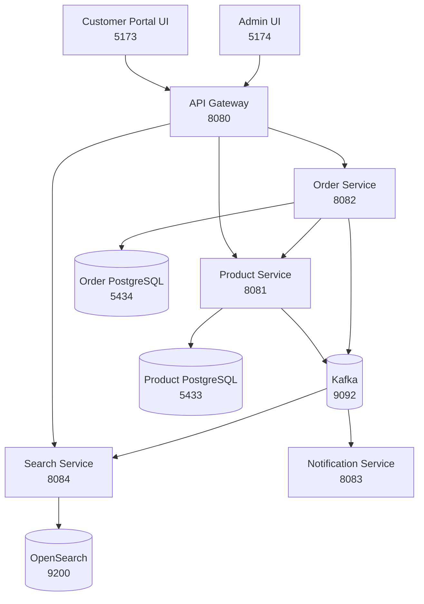

# OrderFlow

OrderFlow is a production-shaped learning project for an order management platform built with Java microservices and two distinct React frontends: a customer ecommerce portal and a credential-gated backoffice.

## Overview

The platform currently includes:

- `portal-ui`: a customer-facing ecommerce storefront
- `admin-ui`: a credential-gated backoffice console
- Spring Cloud Gateway as the API entry point
- Product, order, notification, and search microservices
- PostgreSQL for product and order persistence
- Kafka for asynchronous order events
- OpenSearch for product discovery, faceting, relevance tuning, and search suggestions
- Docker Compose for infrastructure and full-stack container runs
- GitHub Actions for backend and frontend build verification

The frontend split is intentional:

- `portal-ui` is for browsing products, managing a cart, checking out, and tracking orders
- `admin-ui` is for customers, orders, products, search operations, access control, and integration oversight
- the split preserves a clean boundary between public commerce flows and administrative controls
- the current admin credential gate is intentionally documented as a frontend-only control until backend authentication exists

## Architecture



## Repository Structure

```text
orderflow/
├── backend/
│   ├── build.gradle
│   ├── settings.gradle
│   ├── gradlew
│   ├── api-gateway/
│   ├── product-service/
│   ├── order-service/
│   ├── notification-service/
│   └── search-service/
├── frontend/
│   ├── portal-ui/
│   └── admin-ui/
├── docker-compose.yml
├── README.md
└── .github/workflows/build.yml
```

## Technology Stack

### Backend

- Java 21
- Spring Boot 4.0.x
- Spring Framework 7
- Gradle multi-module build
- Spring Web MVC
- Spring Data JPA
- Spring Validation
- Spring Kafka
- Spring Cloud Gateway
- OpenSearch REST API via Spring `RestClient`
- PostgreSQL
- MapStruct
- SpringDoc OpenAPI
- Docker

### Frontend

- React
- TypeScript
- Vite
- Tailwind CSS
- Axios
- React Router
- React Hook Form
- Zod

### Infrastructure

- Docker Compose
- Apache Kafka
- PostgreSQL
- OpenSearch

### CI/CD

- GitHub Actions

## Service Ports

| Component | Port |
| --- | ---: |
| API Gateway | `8080` |
| Product Service | `8081` |
| Order Service | `8082` |
| Notification Service | `8083` |
| Search Service | `8084` |
| Portal UI | `5173` |
| Admin UI | `5174` |
| Product PostgreSQL | `5433` |
| Order PostgreSQL | `5434` |
| Kafka | `9092` |
| OpenSearch | `9200` |
| OpenSearch Performance API | `9600` |

## Frontend Apps

### Portal UI

Location: `frontend/portal-ui`

Purpose:

- customer-facing storefront for browsing active products
- cart and checkout flow backed by the order-service APIs
- self-service order lookup and status tracking
- clear separation from internal administrative workflows

### Admin UI

Location: `frontend/admin-ui`

Purpose:

- restricted backoffice for reviewing customers, orders, and product inventory
- product CRUD management through the same gateway-backed APIs used by the storefront
- search workbench for facet inspection, tuning visibility, and manual reindex controls
- access control, credential boundary, and runtime integration visibility
- a future home for server-enforced RBAC, audit trails, and identity integration

## Backend Services

### Product Service

Base URL: `http://localhost:8081`

Responsibilities:

- manage products
- persist product inventory
- reserve stock for orders
- validate incoming product payloads
- return structured API errors

Endpoints:

- `POST /api/products`
- `GET /api/products`
- `GET /api/products/{id}`
- `PUT /api/products/{id}`
- `DELETE /api/products/{id}`
- `POST /api/products/{id}/reserve`

### Order Service

Base URL: `http://localhost:8082`

Responsibilities:

- validate order requests
- call product-service with `RestClient`
- persist orders and order items
- publish `order.created` Kafka events
- expose order retrieval APIs

Endpoints:

- `POST /api/orders`
- `GET /api/orders`
- `GET /api/orders/{id}`

### Notification Service

Base URL: `http://localhost:8083`

Responsibilities:

- consume Kafka `order.created` events
- log order confirmation delivery
- expose a lightweight status endpoint

Status endpoint:

- `GET /api/notifications/status`

### Search Service

Base URL: `http://localhost:8084`

Responsibilities:

- expose product search and suggestion APIs backed by OpenSearch
- return category, availability, and price-band aggregations alongside search hits
- apply synonym-aware relevance tuning, boosts, and derived popularity scoring
- consume Kafka product indexing events from `product-service`
- rebuild the catalog index from `product-service` on startup and on demand
- keep search concerns isolated from catalog CRUD

Endpoints:

- `GET /api/search/products`
- `GET /api/search/suggestions`
- `GET /api/search/tuning`
- `GET /api/search/synonyms`
- `POST /api/search/synonyms`
- `PUT /api/search/synonyms/{synonymId}`
- `DELETE /api/search/synonyms/{synonymId}`
- `POST /api/search/reindex/products`

### API Gateway

Base URL: `http://localhost:8080`

Routes:

- `/api/products/**` -> `product-service`
- `/api/categories/**` -> `product-service`
- `/api/orders/**` -> `order-service`
- `/api/search/**` -> `search-service`

Both frontends proxy their `/api/*` requests through the gateway.

## Kafka Topics

Order notifications:

- Topic: `order.created`
- Publisher: `order-service`
- Consumer: `notification-service`

Event payload:

- `UUID eventId`
- `Long orderId`
- `String customerName`
- `String customerEmail`
- `BigDecimal totalAmount`
- `String status`
- `LocalDateTime createdAt`

Search indexing:

- Topic: `product.upserted`
- Publisher: `product-service`
- Consumer: `search-service`
- keeps stock, active state, and product details synchronized into OpenSearch

- Topic: `product.deleted`
- Publisher: `product-service`
- Consumer: `search-service`
- removes deleted products from the OpenSearch index

## Search Capabilities

- search results include live facet data for:
  - category aggregations
  - price bands
  - active vs inactive counts
  - in-stock vs out-of-stock counts
- supported search filters include:
  - `q`
  - `categoryCode`
  - `active`
  - `inStock`
  - `minStock`
  - `minPrice`
  - `maxPrice`
  - `priceBand`
  - `excludeProductId`
  - `sort`
- relevance tuning currently combines:
  - runtime-managed synonym expansion
  - explicit field boosts for exact name, prefix, category, and keyword matches
  - derived popularity scoring based on stock depth, freshness, and active state
- synonym groups are now runtime-managed through `search-service` and editable from `admin-ui`
- search-service seeds the synonym catalog once from defaults, then persists edits in a dedicated OpenSearch configuration index
- `admin-ui` exposes a dedicated search workbench to preview those behaviors and trigger a full reindex

## API Documentation

Swagger UI is enabled on every backend service:

- Gateway: `http://localhost:8080/swagger-ui.html`
- Product Service: `http://localhost:8081/swagger-ui.html`
- Order Service: `http://localhost:8082/swagger-ui.html`
- Notification Service: `http://localhost:8083/swagger-ui.html`
- Search Service: `http://localhost:8084/swagger-ui.html`

## Local Run Instructions

### Option A: Full containerized stack

Build and start every service plus both frontends:

```bash
docker compose up --build -d
```

Open:

- Portal UI: `http://localhost:5173`
- Admin UI: `http://localhost:5174`
- API Gateway: `http://localhost:8080`
- Product Service Swagger: `http://localhost:8081/swagger-ui.html`
- Order Service Swagger: `http://localhost:8082/swagger-ui.html`
- Notification Service Swagger: `http://localhost:8083/swagger-ui.html`
- Search Service Swagger: `http://localhost:8084/swagger-ui.html`
- Category API through gateway: `http://localhost:8080/api/categories`
- Product search through gateway: `http://localhost:8080/api/search/products`
- OpenSearch API: `http://localhost:9200`

Useful commands:

```bash
docker compose ps
docker compose logs -f api-gateway product-service order-service search-service notification-service portal-ui admin-ui
docker compose down
docker compose down -v
```

Container wiring details:

- `portal-ui` serves the customer storefront on port `5173`
- `admin-ui` serves the restricted backoffice on port `5174`
- `search-service` reindexes the seeded product catalog on startup so `/shop` is searchable immediately
- OpenSearch runs as a single-node local development container with security disabled for simplicity
- both frontend containers proxy `/api/*` to `api-gateway`
- `admin-ui` bakes its credential gate from `ORDERFLOW_ADMIN_EMAIL` and `ORDERFLOW_ADMIN_PASSWORD` at build time
- `product-service` seeds a sample catalog of 50 products across 10 categories on startup unless `ORDERFLOW_CATALOG_SEED_ENABLED=false`
- category reference data is normalized in a dedicated `categories` table and products store `category_code`
- backend services communicate over Docker service names such as `product-service`, `order-service`, `product-db`, `order-db`, and `kafka`

Default admin credentials for local demo builds:

- Email: `admin@orderflow.local`
- Password: `OrderFlow!Admin123`

Override them before building the admin container if needed:

```bash
ORDERFLOW_ADMIN_EMAIL=ops@example.com ORDERFLOW_ADMIN_PASSWORD='ChangeMe123!' docker compose up --build -d admin-ui
```

### Option B: Run from source with Docker infrastructure only

Start only the infrastructure:

```bash
docker compose up -d product-db order-db kafka
```

Then start the backend services from source.

In one terminal:

```bash
cd backend
./gradlew :product-service:bootRun
```

In a second terminal:

```bash
cd backend
./gradlew :order-service:bootRun
```

In a third terminal:

```bash
cd backend
./gradlew :notification-service:bootRun
```

In a fourth terminal:

```bash
cd backend
./gradlew :api-gateway:bootRun
```

Start the portal UI from source:

```bash
cd frontend/portal-ui
npm install
npm run dev
```

Start the admin UI from source:

```bash
cd frontend/admin-ui
npm install
npm run dev
```

Open:

- Portal UI: `http://localhost:5173`
- Admin UI: `http://localhost:5174`

If you want different local admin credentials for the source build:

```bash
cd frontend/admin-ui
cp .env.example .env
```

Then update:

- `VITE_ADMIN_EMAIL`
- `VITE_ADMIN_PASSWORD`

## Build Commands

### Backend

```bash
cd backend
./gradlew clean test bootJar
```

### Portal UI

```bash
cd frontend/portal-ui
npm install
npm run build
```

### Admin UI

```bash
cd frontend/admin-ui
npm install
npm run build
```

## Docker Assets

Dockerfiles are included for:

- `backend/api-gateway`
- `backend/product-service`
- `backend/order-service`
- `backend/notification-service`
- `frontend/portal-ui`
- `frontend/admin-ui`

The root `docker-compose.yml` supports:

- infrastructure-only runs for source development
- full-stack containerized runs including both frontends

Each backend image uses a multi-stage Docker build that compiles the target Spring Boot module inside the container and then copies the generated JAR into a Java 21 runtime image.

## Code Quality Patterns Used

- layered architecture
- DTO records for API contracts
- constructor injection only
- global exception handling
- structured error responses
- MapStruct mapping
- request logging filters
- bean validation
- OpenAPI metadata per service
- distinct customer and admin frontend boundaries
- explicit documentation of the current auth boundary instead of hiding the limitation

## Learning Objectives

OrderFlow is designed to help you practice:

- Gradle multi-module setup for Spring Boot microservices
- service-to-service calls with `RestClient`
- synchronous inventory reservation
- event publication and consumption with Kafka
- API gateway routing and frontend proxying
- PostgreSQL persistence with JPA
- React form handling and route-driven UI structure
- splitting customer and administrative frontend concerns early
- designing a backoffice around real backend constraints instead of placeholder navigation
- end-to-end local development with Docker Compose
- CI automation with GitHub Actions

## Simplifications

The project is intentionally enterprise-shaped but still learning-focused.

Current simplifications include:

- product reservation is synchronous and per line item
- there is no compensation flow or saga orchestration if a later reservation fails
- notification delivery is simulated through structured logs only
- local JPA auto-update is used instead of a migration tool
- admin-ui authentication is enforced in the frontend only until JWT or Keycloak is added server-side
- customer records are derived from orders because there is no dedicated customer service yet
- order review is available in admin-ui, but status mutation is not yet exposed by the backend

## Future Enhancements

Placeholders for future expansion:

- JWT Authentication
- Keycloak
- Inventory Service
- Email Integration
- Monitoring
- Prometheus
- Grafana
- Kubernetes
- Observability
- Distributed Tracing
- Workflow Approvals
- Role-Based Access Control

## CI Workflow

GitHub Actions runs:

- backend tests and JAR builds
- portal-ui dependency install and production build
- admin-ui dependency install and production build

## Suggested Demo Flow

1. Start the stack with `docker compose up --build -d`.
2. Open `admin-ui`, sign in with the configured credentials, and create a few active products.
3. Open `portal-ui`, browse the catalog, add items to the cart, and submit an order.
4. Return to `admin-ui` to review customers, orders, and product inventory from the backoffice.
5. Check `notification-service` logs to confirm the `order.created` event was consumed.
