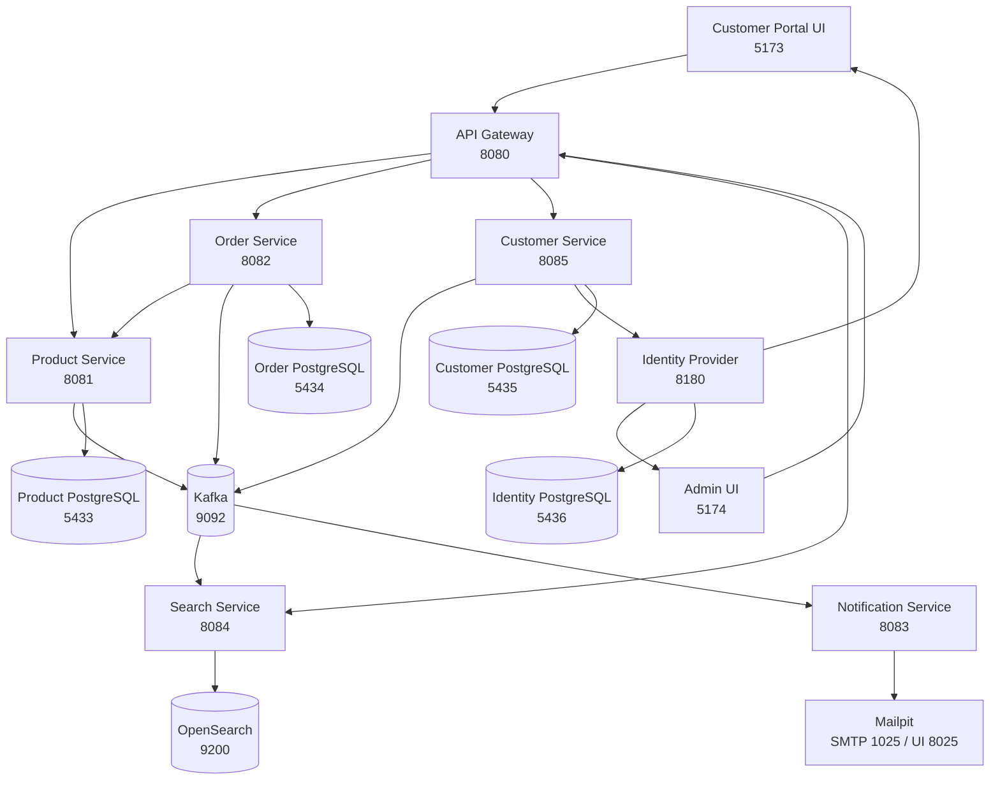

# OrderFlow

OrderFlow is a production-shaped learning project for an order management platform built with Java microservices, OIDC-backed identity, and two distinct React frontends: a customer ecommerce portal and a restricted backoffice.

## Overview

The platform currently includes:

- `portal-ui`: a customer-facing ecommerce storefront
- `admin-ui`: an identity-protected backoffice console
- Spring Cloud Gateway as the API entry point
- Product, order, customer, notification, and search microservices
- PostgreSQL for product, order, customer, and identity persistence
- Kafka for asynchronous order events
- OpenSearch for product discovery, faceting, relevance tuning, and search suggestions
- an OIDC identity provider for JWT authentication, client separation, and role/group-based access
- Mailpit for local SMTP capture and email inspection
- Docker Compose for infrastructure and full-stack container runs
- GitHub Actions for backend and frontend build verification

The frontend split is intentional:

- `portal-ui` is for browsing products, managing a cart, checking out, and tracking orders
- `admin-ui` is for customers, orders, products, search operations, access control, and integration oversight
- the split preserves a clean boundary between public commerce flows and administrative controls
- identity clients, groups, and roles now separate customer and admin access

## Learning Docs

If you want to study the codebase in depth, start with the learning docs:

- [`docs/README.md`](./docs/README.md)
- [`docs/learning/README.md`](./docs/learning/README.md)
- [`docs/learning/01-system-overview.md`](./docs/learning/01-system-overview.md)
- [`docs/learning/02-request-and-event-flows.md`](./docs/learning/02-request-and-event-flows.md)
- [`docs/learning/03-backend-services.md`](./docs/learning/03-backend-services.md)
- [`docs/learning/04-search-and-notifications.md`](./docs/learning/04-search-and-notifications.md)
- [`docs/learning/05-frontend-apps.md`](./docs/learning/05-frontend-apps.md)
- [`docs/learning/06-infrastructure-and-delivery.md`](./docs/learning/06-infrastructure-and-delivery.md)
- [`docs/learning/07-how-to-study-and-extend-orderflow.md`](./docs/learning/07-how-to-study-and-extend-orderflow.md)

## Architecture



## Repository Structure

```text
orderflow/
├── backend/
│   ├── build.gradle
│   ├── settings.gradle
│   ├── gradlew
│   ├── api-gateway/
│   ├── product-service/
│   ├── order-service/
│   ├── customer-service/
│   ├── notification-service/
│   ├── search-service/
│   └── infra/identity-provider/
├── frontend/
│   ├── portal-ui/
│   └── admin-ui/
├── docs/
│   └── learning/
├── docker-compose.yml
├── README.md
└── .github/workflows/build.yml
```

## Technology Stack

### Backend

- Java 25 LTS
- Spring Boot 4.0.7
- Spring Cloud 2025.1.2
- Spring Framework 7
- Gradle multi-module build
- Spring Web MVC
- Spring Data JPA
- Spring Validation
- Spring Kafka
- Spring Cloud Gateway
- Spring Security OAuth2 Resource Server
- OpenSearch REST API via Spring `RestClient`
- PostgreSQL
- MapStruct
- SpringDoc OpenAPI
- Docker

### Frontend

- Node.js 24 LTS
- React 19.2
- TypeScript 6
- Vite 8
- Tailwind CSS 4.3
- Axios
- React Router
- React Hook Form
- Zod

### Infrastructure

- Docker Compose
- Apache Kafka
- PostgreSQL
- OpenSearch
- OIDC identity provider
- Mailpit

### CI/CD

- GitHub Actions

## Development Runtimes

- Java 25 is selected by `.java-version` and enforced by the Gradle toolchain.
- Node.js 24.16.0 is selected by `.nvmrc` and used by CI and frontend Docker builds.
- Run `nvm use` from the repository root before installing frontend dependencies.
- Spring Boot remains on the latest `4.0.x` patch because Spring Cloud `2025.1.x` officially supports Spring Boot `4.0.x`. Spring Boot `4.1.x` should be adopted when a compatible Spring Cloud GA train is available.

## Service Ports

| Component | Port |
| --- | ---: |
| API Gateway | `8080` |
| Product Service | `8081` |
| Order Service | `8082` |
| Notification Service | `8083` |
| Search Service | `8084` |
| Customer Service | `8085` |
| Portal UI | `5173` |
| Admin UI | `5174` |
| Identity Provider | `8180` |
| Product PostgreSQL | `5433` |
| Order PostgreSQL | `5434` |
| Customer PostgreSQL | `5435` |
| Identity PostgreSQL | `5436` |
| Kafka | `9092` |
| OpenSearch | `9200` |
| OpenSearch Performance API | `9600` |
| Mailpit SMTP | `1025` |
| Mailpit Web UI | `8025` |

## Frontend Apps

### Portal UI

Location: `frontend/portal-ui`

Purpose:

- customer-facing storefront for browsing active products
- cart and checkout flow backed by the order-service APIs
- customer registration, sign-in, and account-backed checkout
- a unified Account control that opens sign-in for guests and a complete customer dashboard for authenticated customers
- persistent account navigation with dedicated routes for overview, profile, orders, addresses, payments, security, preferences, and support
- account order routes at `/account/orders` and `/account/orders/{orderCode}` for list and detail views
- first-login reconciliation that creates or relinks the customer-service profile for existing Keycloak customer identities
- self-service order lookup for guests plus owned order history for signed-in customers
- clear separation from internal administrative workflows

### Admin UI

Location: `frontend/admin-ui`

Purpose:

- restricted backoffice for reviewing customers, orders, and product inventory
- product CRUD management through the same gateway-backed APIs used by the storefront
- search workbench for facet inspection, tuning visibility, and manual reindex controls
- access control, credential boundary, and runtime integration visibility
- an identity-protected surface that requires the `admin` access scope

## Backend Services

### Product Service

Base URL: `http://localhost:8081`

Responsibilities:

- manage products
- persist product inventory
- reserve stock for orders
- validate incoming product payloads
- return structured API errors

Endpoints:

- `POST /api/products`
- `GET /api/products`
- `GET /api/products/{id}`
- `PUT /api/products/{id}`
- `DELETE /api/products/{id}`
- `POST /api/products/{id}/reserve`

### Order Service

Base URL: `http://localhost:8082`

Responsibilities:

- validate order requests
- call product-service with `RestClient`
- persist orders and order items
- publish `order.created` Kafka events
- expose order retrieval APIs

Endpoints:

- `POST /api/orders`
- `GET /api/orders`
- `GET /api/orders/me`
- `GET /api/orders/lookup`
- `GET /api/orders/lookup/{id}`
- `GET /api/orders/{id}`

### Notification Service

Base URL: `http://localhost:8083`

Responsibilities:

- consume Kafka `order.created`, `order.cancelled`, and `inventory.low-stock` events
- render HTML email templates with Thymeleaf fragments
- include line-item and pricing-summary rendering for order confirmations
- send or preview notification emails over SMTP
- target Mailpit locally for development inspection
- expose a lightweight status endpoint

Status endpoint:

- `GET /api/notifications/status`

### Customer Service

Base URL: `http://localhost:8085`

Responsibilities:

- register and manage customer profiles
- create and update customer identities through the shared identity provider
- publish customer lifecycle events to Kafka
- track password lifecycle dates for expiring and expired notifications
- keep customer business data separate from credential storage

Endpoints:

- `POST /api/customers/register`
- `GET /api/customers/me`
- `GET /api/customers`
- `GET /api/customers/{customerId}`
- `PUT /api/customers/{customerId}`
- `DELETE /api/customers/{customerId}`
- `POST /api/customers/{customerId}/password`

### Search Service

Base URL: `http://localhost:8084`

Responsibilities:

- expose product search and suggestion APIs backed by OpenSearch
- return category, availability, and price-band aggregations alongside search hits
- apply synonym-aware relevance tuning, boosts, and derived popularity scoring
- consume Kafka product indexing events from `product-service`
- rebuild the catalog index from `product-service` on startup and on demand
- keep search concerns isolated from catalog CRUD

Endpoints:

- `GET /api/search/products`
- `GET /api/search/suggestions`
- `GET /api/search/tuning`
- `GET /api/search/synonyms`
- `POST /api/search/synonyms`
- `PUT /api/search/synonyms/{synonymId}`
- `DELETE /api/search/synonyms/{synonymId}`
- `POST /api/search/reindex/products`

### API Gateway

Base URL: `http://localhost:8080`

Routes:

- `/api/products/**` -> `product-service`
- `/api/categories/**` -> `product-service`
- `/api/orders/**` -> `order-service`
- `/api/customers/**` -> `customer-service`
- `/api/search/**` -> `search-service`

Both frontends proxy their `/api/*` requests through the gateway.

The gateway also validates JWTs from the local OIDC identity provider and currently protects:

- product write operations
- customer self-service profile access
- customer-owned order history and order detail routes
- customer management APIs
- search tuning, synonym management, and reindex APIs
- other non-public routes by default

## Kafka Topics

Order notifications:

- Topic: `order.created`
- Publisher: `order-service`
- Consumer: `notification-service`
- Triggered email: `ORDER_CONFIRMATION`

Event payload:

- `UUID eventId`
- `Long orderId`
- `String customerName`
- `String customerEmail`
- `BigDecimal totalAmount`
- `String status`
- `LocalDateTime createdAt`

- Topic: `order.cancelled`
- Publisher: future `order-service` cancellation flow
- Consumer: `notification-service`
- Triggered email: `ORDER_CANCELLED`

Event payload:

- `UUID eventId`
- `Long orderId`
- `String customerName`
- `String customerEmail`
- `String cancellationReason`
- `LocalDateTime cancelledAt`

- Topic: `inventory.low-stock`
- Publisher: future inventory / product stock monitoring flow
- Consumer: `notification-service`
- Triggered email: `LOW_STOCK_ALERT`

Event payload:

- `UUID eventId`
- `Long productId`
- `String productName`
- `Integer remainingStock`
- `String adminEmail`
- `LocalDateTime createdAt`

Search indexing:

- Topic: `product.upserted`
- Publisher: `product-service`
- Consumer: `search-service`
- keeps stock, active state, and product details synchronized into OpenSearch

- Topic: `product.deleted`
- Publisher: `product-service`
- Consumer: `search-service`
- removes deleted products from the OpenSearch index

Customer identity and lifecycle:

- Topic: `customer.registered`
- Publisher: `customer-service`
- Trigger: successful customer registration through the identity provider plus local profile persistence

- Topic: `customer.upserted`
- Publisher: `customer-service`
- Trigger: customer create and update flows

- Topic: `customer.deleted`
- Publisher: `customer-service`
- Trigger: customer deletion in the identity provider plus local profile removal

- Topic: `customer.password.changed`
- Publisher: `customer-service`
- Trigger: password reset or change through the customer-service API

- Topic: `customer.password.expiring`
- Publisher: `customer-service`
- Trigger: scheduled password-expiry window detection

- Topic: `customer.password.expired`
- Publisher: `customer-service`
- Trigger: scheduled detection of already expired passwords

## Search Capabilities

- search results include live facet data for:
  - category aggregations
  - price bands
  - active vs inactive counts
  - in-stock vs out-of-stock counts
- supported search filters include:
  - `q`
  - `categoryCode`
  - `active`
  - `inStock`
  - `minStock`
  - `minPrice`
  - `maxPrice`
  - `priceBand`
  - `excludeProductId`
  - `sort`
- relevance tuning currently combines:
  - runtime-managed synonym expansion
  - explicit field boosts for exact name, prefix, category, and keyword matches
  - derived popularity scoring based on stock depth, freshness, and active state
- synonym groups are now runtime-managed through `search-service` and editable from `admin-ui`
- search-service seeds the synonym catalog once from defaults, then persists edits in a dedicated OpenSearch configuration index
- `admin-ui` exposes a dedicated search workbench to preview those behaviors and trigger a full reindex

## API Documentation

Swagger UI is enabled on every backend service:

- Gateway: `http://localhost:8080/swagger-ui.html`
- Product Service: `http://localhost:8081/swagger-ui.html`
- Order Service: `http://localhost:8082/swagger-ui.html`
- Notification Service: `http://localhost:8083/swagger-ui.html`
- Search Service: `http://localhost:8084/swagger-ui.html`
- Customer Service: `http://localhost:8085/swagger-ui.html`

## Local Run Instructions

### Option A: Full containerized stack

Build and start every service plus both frontends:

```bash
docker compose up --build -d
```

Open:

- Portal UI: `http://localhost:5173`
- Admin UI: `http://localhost:5174`
- Mailpit UI: `http://localhost:8025`
- OIDC Realm Metadata: `http://localhost:8180/realms/oflio`
- Identity Admin Console: `http://localhost:8180/admin/`
- API Gateway: `http://localhost:8080`
- Product Service Swagger: `http://localhost:8081/swagger-ui.html`
- Order Service Swagger: `http://localhost:8082/swagger-ui.html`
- Notification Service Swagger: `http://localhost:8083/swagger-ui.html`
- Search Service Swagger: `http://localhost:8084/swagger-ui.html`
- Customer Service Swagger: `http://localhost:8085/swagger-ui.html`
- Category API through gateway: `http://localhost:8080/api/categories`
- Product search through gateway: `http://localhost:8080/api/search/products`
- OpenSearch API: `http://localhost:9200`

Useful commands:

```bash
docker compose ps
docker compose logs -f api-gateway product-service order-service customer-service search-service notification-service portal-ui admin-ui keycloak
docker compose down
docker compose down -v
```

Container wiring details:

- `portal-ui` serves the customer storefront on port `5173`
- `admin-ui` serves the restricted backoffice on port `5174`
- `customer-service` exposes customer lifecycle APIs on port `8085`
- the local identity provider serves OIDC endpoints and the admin console on port `8180`
- `search-service` reindexes the seeded product catalog on startup so `/shop` is searchable immediately
- OpenSearch runs as a single-node local development container with security disabled for simplicity
- both frontend containers proxy `/api/*` to `api-gateway`
- both frontends are configured for distinct identity clients: `oflio-portal-ui` and `oflio-admin-ui`
- `product-service` seeds a sample catalog of 50 products across 10 categories on startup unless `ORDERFLOW_CATALOG_SEED_ENABLED=false`
- category reference data is normalized in a dedicated `categories` table and products store `category_code`
- `notification-service` delivers order confirmation emails to Mailpit over SMTP in local development
- backend services communicate over Docker service names such as `product-service`, `order-service`, `customer-service`, the identity-provider service, and `kafka`

Default local realm users:

- Backoffice admin:
  - username/email: `admin@oflio.local`
  - password: `Admin123!`
- Storefront customer:
  - username/email: `customer@oflio.local`
  - password: `Customer123!`
- Identity bootstrap admin:
  - username: `admin`
  - password: `admin`

Frontend identity wiring:

```bash
VITE_AUTH_URL=http://localhost:8180
VITE_AUTH_REALM=oflio
VITE_AUTH_CLIENT_ID=oflio-admin-ui
VITE_REQUIRED_SCOPE=admin
```

### Option B: Run from source with Docker infrastructure only

Start only the infrastructure:

```bash
docker compose up -d product-db order-db customer-db keycloak-db kafka opensearch mailpit keycloak
```

Then start the backend services from source.

In one terminal:

```bash
cd backend
./gradlew :product-service:bootRun
```

In a second terminal:

```bash
cd backend
./gradlew :order-service:bootRun
```

In a third terminal:

```bash
cd backend
./gradlew :customer-service:bootRun
```

In a fourth terminal:

```bash
cd backend
./gradlew :notification-service:bootRun
```

In a fifth terminal:

```bash
cd backend
./gradlew :api-gateway:bootRun
```

Start the portal UI from source:

```bash
cd frontend/portal-ui
npm install
npm run dev
```

Start the admin UI from source:

```bash
cd frontend/admin-ui
npm install
npm run dev
```

Open:

- Portal UI: `http://localhost:5173`
- Admin UI: `http://localhost:5174`
- Mailpit UI: `http://localhost:8025`
- OIDC Realm Metadata: `http://localhost:8180/realms/oflio`

## Notification Templates

Notification templates live in `backend/notification-service/src/main/resources/templates/email`:

```text
templates/email/
├── fragments/
│   ├── footer.html
│   ├── header.html
│   └── styles.html
├── low-stock-alert.html
├── order-cancelled.html
└── order-confirmation.html
```

Current order confirmation emails include:

- line items
- small thumbnail placeholders per product
- quantity, rate, and line price
- subtotal, tax, shipping, discount, and grand total summary rows

## Testing Notification Emails

With the full stack running, `notification-service` consumes Kafka events and turns them into HTML emails. By default, the application property `notification.email.enabled=false` logs previews only. In Docker Compose, the running service overrides that to `true` so Mailpit receives the messages.

Use Mailpit:

- Web UI: `http://localhost:8025`
- SMTP endpoint from the Docker network: `mailpit:1025`
- SMTP endpoint from the host: `localhost:1025`

Typical flow:

1. create or use an active product
2. place an order through `portal-ui` or `POST /api/orders`
3. open Mailpit and inspect the captured confirmation email

To preview emails without sending them, keep:

- `notification.email.enabled=false`

To enable SMTP delivery outside Docker Compose, set:

- `NOTIFICATION_EMAIL_ENABLED=true`
- `MAIL_HOST=<smtp-host>`
- `MAIL_PORT=<smtp-port>`
- `NOTIFICATION_EMAIL_FROM=<from-address>`

Mailpit also exposes a REST API for automated checks:

- `http://localhost:8025/api/v1/`

If you want local frontend identity overrides for the source build:

```bash
cd frontend/admin-ui
cp .env.example .env
```

Then update:

- `VITE_AUTH_URL`
- `VITE_AUTH_REALM`
- `VITE_AUTH_CLIENT_ID`
- `VITE_REQUIRED_SCOPE`

## Build Commands

### Backend

```bash
cd backend
./gradlew clean test bootJar
```

### Portal UI

```bash
cd frontend/portal-ui
npm install
npm run build
```

### Admin UI

```bash
cd frontend/admin-ui
npm install
npm run build
```

## Docker Assets

Dockerfiles are included for:

- `backend/api-gateway`
- `backend/product-service`
- `backend/order-service`
- `backend/notification-service`
- `frontend/portal-ui`
- `frontend/admin-ui`

The root `docker-compose.yml` supports:

- infrastructure-only runs for source development
- full-stack containerized runs including both frontends

Each backend image uses a multi-stage Docker build that compiles the target Spring Boot module inside the container and then copies the generated JAR into a Java 25 runtime image.

## Code Quality Patterns Used

- layered architecture
- DTO records for API contracts
- constructor injection only
- global exception handling
- structured error responses
- MapStruct mapping
- request logging filters
- bean validation
- OpenAPI metadata per service
- distinct customer and admin frontend boundaries
- distinct identity clients, roles, and groups for customer and admin access boundaries

## Learning Objectives

OrderFlow is designed to help you practice:

- Gradle multi-module setup for Spring Boot microservices
- service-to-service calls with `RestClient`
- synchronous inventory reservation
- event publication and consumption with Kafka
- API gateway routing and frontend proxying
- PostgreSQL persistence with JPA
- React form handling and route-driven UI structure
- splitting customer and administrative frontend concerns early
- separating identity from customer business data
- validating OIDC JWTs at the gateway edge
- designing a backoffice around real backend constraints instead of placeholder navigation
- end-to-end local development with Docker Compose
- CI automation with GitHub Actions

## Simplifications

The project is intentionally enterprise-shaped but still learning-focused.

Current simplifications include:

- product reservation is synchronous and per line item
- there is no compensation flow or saga orchestration if a later reservation fails
- notification emails are delivered locally through Mailpit and can be switched to preview-only mode with configuration
- local JPA auto-update is used instead of a migration tool
- gateway JWT enforcement is now in place, and customer-service plus order-service also enforce scope and ownership checks for customer-facing resources
- product-service, search-service, and notification-service still rely primarily on the gateway edge for authorization
- password-expiry events are currently driven by customer-service lifecycle timestamps rather than native identity-provider event listeners
- order review is available in admin-ui, but status mutation is not yet exposed by the backend

## Future Enhancements

Placeholders for future expansion:

- customer self-service account pages
- identity-provider abstraction hardening
- finer-grained authorization policies across catalog, customer, and search operations
- Inventory Service
- Email Integration
- Monitoring
- Prometheus
- Grafana
- Kubernetes
- Observability
- Distributed Tracing
- Workflow Approvals
- Role-Based Access Control

## CI Workflow

GitHub Actions runs:

- backend tests and JAR builds
- portal-ui dependency install and production build
- admin-ui dependency install and production build

## Suggested Demo Flow

1. Start the stack with `docker compose up --build -d`.
2. Open `admin-ui`, sign in with `admin@oflio.local / Admin123!`, and create a few active products.
3. Open `portal-ui`, register a new customer account or sign in as `customer@oflio.local / Customer123!`.
4. Place one order while signed in and one order as a guest to exercise both customer-owned history and guest lookup.
5. Return to `portal-ui /account` and `portal-ui /track-order` to verify the owned-order and guest-order flows separately.
6. Return to `admin-ui` to review customers, orders, and product inventory from the backoffice.
7. Check `notification-service` logs or Mailpit to confirm the `order.created` event was consumed and the email was delivered.
